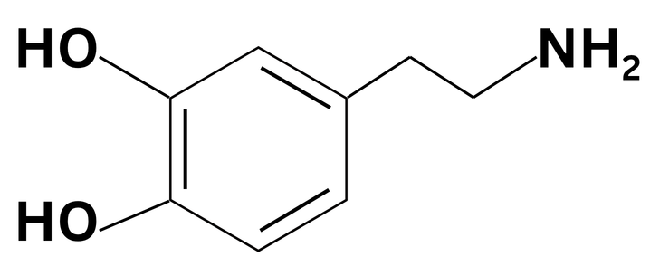
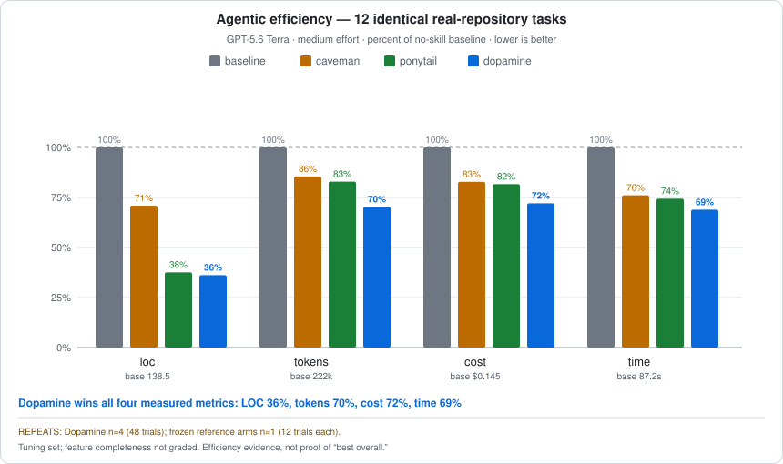

<p align="center">
  
</p>

<h1 align="center">Dopamine</h1>

<p align="center">
  <em>Predict. Act. Measure. Learn. Stop.</em>
</p>

<p align="center">
  
  
  
  
</p>

<p align="center">
  <strong>63.8% less code &middot; 29.7% fewer tokens &middot; 27.9% lower estimated cost &middot; 31.1% faster</strong><br>
  <sub>Measured against the no-skill baseline across 12 real-repository tasks using GPT-5.6 Terra at medium effort. Against the frozen Ponytail run, Dopamine v14 measured 3.7% less code, 15.2% fewer tokens, 11.8% lower estimated cost, and 7.4% less wall time. Dopamine n=4; reference arms n=1; development set; feature completeness was not graded. <a href="bench/REPORT.md">Full report</a> &middot; <a href="bench/results/agentic-tuning-summary.json">raw summary</a>.</sub>
</p>

---

Humans do not spend maximum effort on every action. We predict what might work, act, observe the difference between expectation and outcome, update, and stop when the result is good enough.

Dopamine puts that feedback discipline inside an AI agent.

It is a compact agent skill for coding, debugging, research, analysis, and planning. It pushes the agent toward the smallest verified result—not merely the shortest answer, the fewest lines at any cost, or endless reasoning disguised as rigor.

## Human-inspired, not human-simulated

The name comes from a careful analogy to the human dopamine system.

Dopamine is not accurately described as a simple “pleasure chemical.” Research connects dopaminergic activity to reinforcement learning, reward prediction error, motivation, effort allocation, and behavioral vigor. Reward prediction error is the difference between an expected outcome and the outcome actually observed; that signal can update future behavior. Dopamine has also been associated with willingness to work and the vigor of reward-oriented behavior.

Dopamine translates those ideas into an engineering loop:

| Human inspiration | Agent behavior |
|---|---|
| Expected outcome | Define observable completion conditions |
| Selective effort | Choose Direct, Probe, Explore, or Guarded effort |
| Action | Take the cheapest high-information step |
| Prediction error | Compare the observed result with the prediction |
| Learning | Continue, change the hypothesis, or replace the approach |
| Stable result | Stop when the completion checks pass |

This is a design metaphor, not a neuroscientific simulation. The skill does not model neurotransmitters, diagnose conditions, alter model weights, or create persistent biological-style learning.

Background reading: [dopamine and reward-prediction-error circuitry](https://pmc.ncbi.nlm.nih.gov/articles/PMC6721851/), [dopamine, motivation, and willingness to work](https://pmc.ncbi.nlm.nih.gov/articles/PMC4696912/), and [subsecond prediction-error signals measured in humans](https://pmc.ncbi.nlm.nih.gov/articles/PMC10691773/).

## Before / after

You ask for a date picker. An unconstrained agent may build a calendar, navigation logic, popovers, keyboard handling, styling, parsing, and timezone policy.

With Dopamine, the agent checks the solution ladder first:

```tsx
import * as React from "react"

import { Input } from "@/components/ui/input"

function DatePicker(props: Omit<React.ComponentProps<typeof Input>, "type">) {
  return <Input type="date" {...props} />
}

export { DatePicker }
```

The browser already owns date selection. The project already owns the input style. The component only needs to connect them.

Dopamine does not demand a one-liner when the task needs more. It demands evidence before moving to a more expensive rung.

## Numbers

The benchmark uses a real checkout of [`tiangolo/full-stack-fastapi-template`](https://github.com/fastapi/full-stack-fastapi-template), pinned at commit `cd83fc10ca20393e9ee50e3005e170c6929e047e`. A headless Codex session implements 12 identical frontend and backend feature tickets. The harness measures the Git diff and final usage event.

<p align="center">
  
</p>

### Percent of no-skill baseline

Lower is better.

| Arm | Source LOC | Tokens | Estimated cost | Time |
|---|---:|---:|---:|---:|
| no skill | 100.0% | 100.0% | 100.0% | 100.0% |
| Caveman | 70.9% | 85.5% | 82.8% | 76.1% |
| Ponytail | 37.6% | 82.9% | 81.7% | 74.4% |
| **Dopamine v14 (n=4)** | **36.2%** | **70.3%** | **72.1%** | **68.9%** |

### Absolute means per task

| Arm | Added source LOC | Processed tokens | Estimated cost | Wall time |
|---|---:|---:|---:|---:|
| no skill | 138.5 | 222,256 | $0.1447 | 87.2 s |
| Caveman | 98.3 | 190,097 | $0.1198 | 66.3 s |
| Ponytail | 52.1 | 184,212 | $0.1183 | 64.9 s |
| **Dopamine v14 (n=4)** | **50.2** | **156,277** | **$0.1044** | **60.1 s** |

### Direct comparison with Ponytail

| Metric | Difference |
|---|---:|
| Source LOC | **3.7% lower** |
| Processed tokens | **15.2% lower** |
| Estimated cost | **11.8% lower** |
| Wall time | **7.4% lower** |

The measured claim is deliberately narrow:

> On this 12-task development set, Dopamine v14 measured lower source LOC, processed tokens, API-equivalent estimated cost, and wall time than the recorded Ponytail run.

It does **not** prove that Dopamine is the best skill overall. The tasks were repeatedly used while tuning Dopamine, competitors were not rerun after each revision, competitor cells have only `n=1`, and the feature tickets lack executable completeness graders. See [Benchmark integrity and limitations](#benchmark-integrity-and-limitations).

## What LOC means

LOC means lines of code. This benchmark counts added source lines from Git numstat after staging the agent's completed workspace.

It includes source extensions such as `.py`, `.ts`, `.tsx`, `.js`, `.jsx`, `.html`, and `.css`. It excludes tests, lock files, generated files, dependencies, and non-code artifacts.

Lower LOC can mean a smaller maintenance surface, but it is not automatically better. Missing behavior also produces small diffs. Dopamine treats LOC as an efficiency metric only after required correctness and safety conditions are preserved.

## How it works

### 1. Start with a solution ladder

The agent stops at the first rung that completely satisfies the request:

```text
1. Existing behavior or deletion
2. Configuration
3. Existing project component, helper, pattern, or interface
4. Native platform or standard-library primitive
5. Already-installed dependency
6. Smallest custom implementation
```

If two solutions work, Dopamine chooses fewer changed source lines. If they tie, it chooses fewer files and less state.

### 2. Keep a literal delivery boundary

The requested artifact defines the implementation boundary:

- A component request produces a reusable component, not an arbitrarily mounted product feature.
- A native form control wraps the project's existing input instead of recreating browser behavior.
- An endpoint request stays in the backend unless a client or UI is explicitly requested.
- A capability is implemented at the lowest existing callable layer.
- A bug fix repairs the shared root cause rather than growing a framework around the symptom.

For underspecified interactions, Dopamine implements the primary interaction and accessible native fallback. It does not automatically add global shortcuts, elaborate keyboard-selection state, animation, hover or drag decoration, responsive variants, previews, persistence, or product-specific policy.

### 3. Match effort to uncertainty

| Route | Use it when | Default behavior |
|---|---|---|
| **Direct** | One canonical path, low risk | One focused inspection, edit, and check |
| **Probe** | Cause or context is uncertain | Test at most three live hypotheses |
| **Explore** | Consequential alternatives remain | Compare at most three candidates; deepen one |
| **Guarded** | Security, money, privacy, auth, migration, destruction, or compatibility | Normal route plus an adversarial boundary check |

Large does not automatically mean Explore. Risk and uncertainty—not task size—control effort.

### 4. Run the feedback loop

```text
Predict → Act → Measure → Update
```

- Supporting evidence: continue.
- No information: choose a more discriminating action.
- Contradiction: replace the hypothesis.
- Failed verification: repair the smallest demonstrated defect.
- Passing completion conditions: stop.

The agent never repeats an unchanged failed action and never adds speculative work after the result is complete.

### 5. Verify the artifact

Dopamine prefers executable evidence over model judgment. It selects the smallest decisive check, then broadens only when risk justifies it.

For complex outputs it checks relevant invariants: format, completeness, domains, ordering, uniqueness, reachability, conservation, referential integrity, and boundary behavior. For bulk transformations it validates the complete output rather than a convenient sample.

Security controls, trust-boundary validation, accessibility basics, public compatibility, and error handling that prevents data loss are never valid targets for simplification.

## Install

Dopamine currently ships as a standalone [Agent Skill](https://learn.chatgpt.com/docs/build-skills): a `SKILL.md` file, optional references, and UI metadata.

### Repository-scoped Codex skill

From the repository where you want Dopamine available:

```sh
mkdir -p .agents/skills
cp -R /path/to/Dopamine/skills/dopamine .agents/skills/dopamine
```

Codex discovers repository skills from `.agents/skills` between the working directory and repository root.

### User-scoped Codex skill

To make it available across repositories:

```sh
mkdir -p "$HOME/.agents/skills"
cp -R /path/to/Dopamine/skills/dopamine "$HOME/.agents/skills/dopamine"
```

Restart Codex if a newly installed skill does not appear.

### Use directly from this checkout

Launch Codex from the project root and invoke the skill explicitly:

```text
Use $dopamine to implement this with the smallest verified change.
```

The skill can also activate implicitly when a task matches its description.

### Other Agent Skills hosts

The core package follows the open Agent Skills directory format. Installation locations and invocation syntax differ by host. Only the Codex paths above are tested by this repository; support for other hosts should not be assumed without validation.

## Usage

### Minimal feature

```text
Use $dopamine to add a reusable date picker component.
```

### Root-cause debugging

```text
Use $dopamine to reproduce this failure, identify the shared root cause, make the smallest fix, and run the decisive regression check.
```

### Guarded security work

```text
Use $dopamine to fix this authorization bug. Preserve the public API and verify both the allowed and denied paths.
```

### Research

```text
Use $dopamine to answer this from primary sources with only the evidence needed to support the conclusion.
```

### Analysis

```text
Use $dopamine to calculate this result reproducibly, test the boundary cases, and state any remaining uncertainty.
```

## Benchmark integrity and limitations

The repository publishes the method, raw results, hashes, negative experiments, and known limitations so the result can be audited.

### Controlled variables

- Same pinned real repository and commit
- Same 12 task prompts
- Same `gpt-5.6-terra` model
- Same medium reasoning effort
- Same Codex CLI version (`0.147.0`)
- Same timeout and source-LOC calculation
- One isolated workspace per cell

### Frozen artifacts

| Artifact | SHA-256 |
|---|---|
| Reference results | `6ca53e0f7b4c08297e1626d6e508b7e9b2e05b2afbcd839b89bb13772447cafb` |
| Dopamine v14 n=4 results | `df511691abdae5d0a84e7d2ef3a4846b85b29daed842816df9897cc0898c4b2b` |
| Dopamine v14 `SKILL.md` | `cf1d03db066527fe1f1aad927720a68dc27b35fa4179760cf948d191452b7720` |

All 48 v14 trials (12 tasks × 4 repeats) completed with exit code zero, no harness timeouts, usage data, and a nonzero source diff.

### Why competitors were not rerun

The competitor measurements remain frozen because rerunning them later could introduce model, service, or environment drift. Dopamine-only iterations preserve the original competitor rows, but they also make the final result a tuned development-set comparison rather than a simultaneous independent trial.

### Known limitations

1. Dopamine was tuned after inspecting these tasks.
2. Dopamine has four repeats per task, but each frozen competitor arm has one; competitor variance is unknown.
3. Competitor runs are prior frozen measurements rather than simultaneous trials.
4. Feature completeness was not executable-graded.
5. Cost is an API-equivalent estimate from recorded tokens, not observed Codex subscription billing.
6. LOC, tokens, cost, and time do not measure maintainability, security, usability, or correctness by themselves.

Historical executable regression tasks against the older v7 candidate failed overall: 30/48 lab-unit checks and 13/16 manufacturing-normalization checks passed. Those results are published in [`bench/results/correctness-regressions.json`](bench/results/correctness-regressions.json). They do not score v14, but they are evidence against making broad “best overall” claims without new correctness-graded holdouts.

## Reproduce

### Validate the package

```sh
python3 scripts/validate_skill.py
python3 -m unittest discover -s tests -v
python3 bench/report_agentic.py
```

These checks require only Python's standard library.

### Regenerate the chart and summary

```sh
python3 bench/report_agentic.py
```

The command reads the two published result files and regenerates:

- `assets/benchmark-agentic-dopamine.svg`
- `bench/results/agentic-tuning-summary.json`

CI fails if regeneration changes committed outputs.

### Run Dopamine on the 12 tasks

```sh
python3 bench/run_agentic_metrics.py \
  --arms dopamine \
  --repeats 4 \
  --workers 8 \
  --model gpt-5.6-terra \
  --effort medium
```

This command requires an authenticated Codex installation and network access. It creates isolated fixture copies under `bench/runs/` and retains raw events, errors, diffs, usage, and timing for audit.

### Protocol for a defensible overall claim

Before claiming that one skill is best overall:

1. Freeze every skill hash.
2. Pre-register unseen tasks and executable correctness graders.
3. Randomize or interleave the arms.
4. Run at least three repeats per cell.
5. Require the same correctness threshold before comparing efficiency.
6. Report medians, dispersion or confidence intervals, timeouts, and failures.
7. Do not modify the skill after inspecting holdout results.

## Project structure

```text
Dopamine/
├── skills/dopamine/
│   ├── SKILL.md                    # compact agent workflow
│   ├── agents/openai.yaml          # display metadata
│   └── references/verification.md  # verification routing
├── assets/
│   └── benchmark-agentic-dopamine.svg
├── bench/
│   ├── run_agentic_metrics.py      # real-repository benchmark
│   ├── run_benchmark.py            # correctness-graded task runner
│   ├── report_agentic.py           # deterministic report generator
│   ├── REPORT.md                   # full methodology and limitations
│   └── results/                    # machine-readable summaries
├── scripts/validate_skill.py
├── tests/
└── .github/workflows/ci.yml
```

## Development

Keep the skill compact. Instructions consume the same context needed for the actual task, so new prose must justify its token cost.

Before submitting a change:

```sh
python3 scripts/validate_skill.py
python3 -m unittest discover -s tests -v
python3 bench/report_agentic.py
```

For behavioral changes:

1. State the observed failure mode.
2. Change a general rule, not a benchmark-task answer.
3. Test on development tasks.
4. Reject regressions instead of rationalizing them.
5. Freeze the candidate before holdout evaluation.
6. Publish negative results.

See [CONTRIBUTING.md](CONTRIBUTING.md) for the contribution policy and [SECURITY.md](SECURITY.md) for vulnerability reporting.

## FAQ

### Is Dopamine just “write fewer lines”?

No. The objective is the smallest **verified** complete result. Necessary validation, security, accessibility, compatibility, and data-loss prevention stay intact.

### Does Dopamine guarantee fewer tokens or faster work?

No. Results depend on the model, task, repository, tools, cache behavior, service load, and how well the model follows the skill. The published numbers describe one controlled development benchmark.

### Does it learn permanently?

No. “Learn” describes the within-task update loop: use evidence to change the next action. Dopamine does not retrain the model or promise cross-session memory.

### Why did compacting the skill help?

The minimality rules became easier for the agent to find and follow. The final skill is 73 lines and roughly 5.9 KB, compared with the earlier 130-line, 10.3 KB version. Less instruction competition also reduces prompt context.

### Is Dopamine better than Ponytail?

On the published 12-task development set, Dopamine v14 is lower on all four measured efficiency metrics. That is the complete supported claim. Independent, repeated, correctness-graded holdouts are still required for a general superiority claim.

### Is Dopamine better than Caveman or ADHD-style skills?

The published agentic chart includes Caveman and shows Dopamine lower on the four efficiency metrics in this dataset. The current chart does not include an equal-protocol ADHD arm, so no equivalent claim is made here.

### Why “Dopamine”?

Because the skill is built around prediction, action, measured error, adaptive effort, and stopping—an engineering analogy to dopamine's roles in learning and motivation. It is not named for artificial excitement, addictive engagement, or “pleasure hacking.”

### Can I combine it with other skills?

Possibly, but overlapping instructions can compete. Validate the combination on your own tasks rather than assuming two individually useful skills will compose cleanly.

### What does “estimated cost” mean?

The harness applies its recorded GPT-5.6 Terra input, cached-input, and output rates to measured token usage. Actual Codex subscription billing may differ.

## Security

Dopamine is instruction-only at runtime. It requires no secrets, telemetry, background service, package installation, or network connection of its own. The benchmark scripts invoke the user's installed Codex CLI and inherit its authentication, approval, sandbox, and network configuration.

Never weaken a verifier, authorization boundary, input validation, secret handling, or data-loss protection to improve an efficiency score.

Report vulnerabilities privately as described in [SECURITY.md](SECURITY.md).

## Credits

Dopamine's benchmark presentation was informed by Ponytail's transparent real-repository benchmarking style. Dopamine's workflow and implementation are original and center on adaptive evidence loops, delivery boundaries, and verified progress per unit cost.

The project also builds on the open Agent Skills format used by Codex and other compatible hosts.

## License

[MIT](LICENSE). Use it, test it, challenge it, and publish the failures too.
